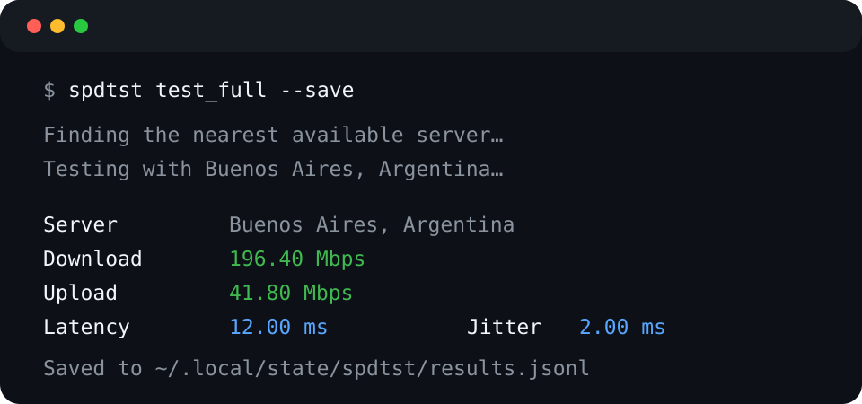

# spdtst

> A small, private-by-default internet speed test for the terminal.

`spdtst` measures download speed, upload speed, latency, and jitter. `test_full` also reports the public IP, ISP, and approximate location that the selected test endpoint can provide. It automatically finds a responsive public LibreSpeed-compatible server, or can use a server you provide.



## Why spdtst?

- **Simple:** one command, readable output.
- **Portable:** Python 3.10+ with a small MIT-licensed system-certificate helper.
- **Private by default:** no accounts, telemetry, or result sharing. Connection details are requested only by `test_full`.
- **Open:** MIT-licensed project code and no dependency on a proprietary test client.
- **Scriptable:** use JSON output or save newline-delimited JSON locally.

## Install

Use [pipx](https://pipx.pypa.io/) to install the current release in an isolated environment:

```bash
pipx install https://github.com/brunozapico/spdtst/releases/download/v0.1.0/spdtst-0.1.0-py3-none-any.whl
```

Homebrew users can install the same release with:

```bash
brew tap brunozapico/tap
brew install spdtst
```

To install directly from the repository instead:

```bash
pipx install git+https://github.com/brunozapico/spdtst.git
```

Verify the installation:

```bash
spdtst --version
```

## Usage

Run the standard network test (download, upload, latency, and jitter):

```bash
spdtst test
```

Run the extended test, which adds public IP, ISP, and approximate location when the endpoint supports it:

```bash
spdtst test_full
```

`test-full` is also accepted as a shell-friendly alias.

### Commands and options

| Command | Description |
| --- | --- |
| `spdtst test` | Finds a responsive public server, then measures download, upload, latency, and jitter. |
| `spdtst test_full` | Runs the network test plus public IP, ISP, and approximate location. |
| `spdtst test-full` | Alias for `test_full`. |
| `spdtst --version` | Prints the installed version. |
| `spdtst --help` | Shows command help. |

Both test commands accept:

| Option | Description |
| --- | --- |
| `--server URL` | Use this LibreSpeed-compatible backend instead of automatic discovery. |
| `--duration SECONDS` | Set the duration of each transfer measurement; default: 5 seconds. |
| `--output json` | Print a machine-readable JSON result. |
| `--save` | Append the result to the default local history file. |
| `--save-to PATH` | Append the result to a chosen JSONL file; also enables saving. |

Examples:

```bash
spdtst test_full --save
spdtst test --server https://speed.example.com/backend
spdtst test_full --output json
spdtst test --duration 10 --save-to ./speed-history.jsonl
```

## Saved results

`--save` stores one JSON object per line (JSONL), which is easy to inspect or process with other tools. Its default location is platform-aware:

| Platform | Default file |
| --- | --- |
| macOS | `~/Library/Application Support/spdtst/results.jsonl` |
| Linux | `$XDG_STATE_HOME/spdtst/results.jsonl`, or `~/.local/state/spdtst/results.jsonl` |
| Windows | `%LOCALAPPDATA%\\spdtst\\results.jsonl` |

No results are saved unless `--save` or `--save-to` is supplied.

## How server discovery works

Without `--server`, spdtst retrieves the public server directory maintained by LibreSpeed and probes its available entries in parallel. It runs the test against the responsive server with the lowest observed latency. Public servers are external services, so availability and their terms can change; `--server` is the deterministic option for personal or organizational use.

spdtst implements its client protocol itself with Python's standard library. It does not vendor LibreSpeed code or use Speedtest by Ookla services, brands, or APIs. LibreSpeed-compatible endpoints are a protocol choice, not a bundled dependency. `test_full` asks the selected endpoint for connection details; because this data is controlled by that endpoint, some fields may be unavailable or only approximate.

## Stack

- Python 3.10+
- Python standard library (`argparse`, `urllib`, `concurrent.futures`)
- [truststore](https://pypi.org/project/truststore/) (MIT) to use the operating system's trusted certificates
- `setuptools` for packaging
- `unittest` for the included test suite

## License

The spdtst source code is available under the [MIT License](LICENSE).

This is an independent project and is not affiliated with LibreSpeed or Ookla.
